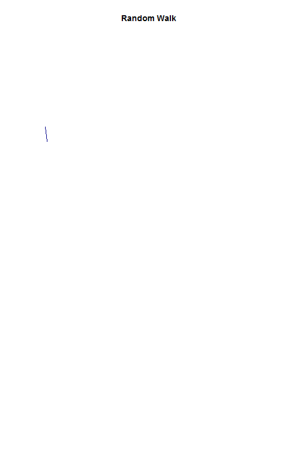

Data Driven Management II - Lab 2
================
Kyle Crichton
February 1, 2017

Random Walk Animation
=====================

Setup
-----

Generate 100 random culmulative values.

Store in a new vector variable to be used in the animation.

``` r
random.walk <- cumsum(rnorm(100))
```

Calculate the maximum and minimum values in the random walk to set scope for plotting.

Calculate and display minimum value.

``` r
y.min <- min(random.walk)
y.max <- max(random.walk)
```

Create Animation
----------------

Generate animation for the random walk.

``` r
ani.options(convert = 'C:/Program Files/ImageMagick-7.0.4-Q16/convert.exe') 

saveGIF({
for( i in 2:100 )
{
plot( random.walk[1:i], type="l", col="darkblue", axes=F, xlab="", ylab="", main="Random Walk",xlim=c(0,100), ylim=c(y.min,y.max))
}
}, 
movie.name = "KR_Random_Walk.gif",interval = 0.2, animation.width = 800, ani.height = 800)
```

Display the GIF animation created.


